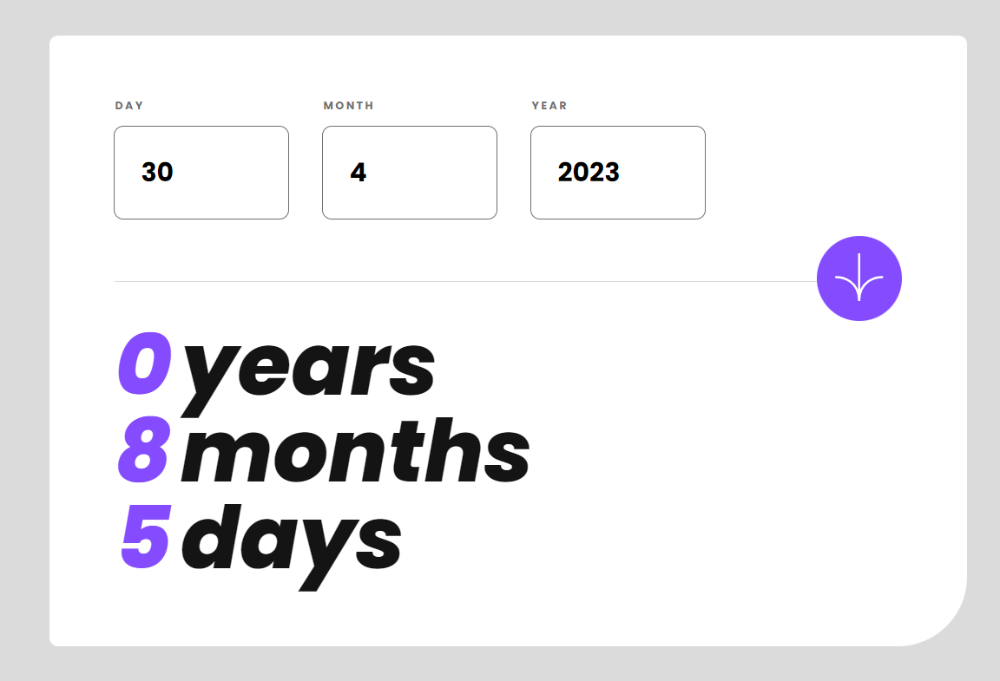

# Frontend Mentor - Age calculator app solution

This is a solution to the [Age calculator app challenge on Frontend Mentor](https://www.frontendmentor.io/challenges/age-calculator-app-dF9DFFpj-Q). Frontend Mentor challenges help you improve your coding skills by building realistic projects.

## Table of contents

- [Overview](#overview)
  - [The challenge](#the-challenge)
  - [Screenshot](#screenshot)
  - [Links](#links)
- [My process](#my-process)
  - [Built with](#built-with)
  - [What I learned](#what-i-learned)
  - [Continued development](#continued-development)
  - [Useful resources](#useful-resources)
- [Author](#author)

## Overview

### The challenge

Users should be able to:

- View an age in years, months, and days after submitting a valid date through the form
- Receive validation errors if:
  - Any field is empty when the form is submitted
  - The day number is not between 1-31
  - The month number is not between 1-12
  - The year is in the future
  - The date is invalid e.g. 31/04/1991 (there are 30 days in April)
- View the optimal layout for the interface depending on their device's screen size
- See hover and focus states for all interactive elements on the page
- [TODO] **Bonus**: See the age numbers animate to their final number when the form is submitted

### Screenshot

### Links

- Solution URL: [Add solution URL here](https://your-solution-url.com)
- Live Site URL: [Add live site URL here](https://your-live-site-url.com)

## My process

### Built with

- Semantic HTML5 markup
- CSS custom properties
- Flexbox
- JS

### What I learned

- Styling form elements
- Handle dates
- Get deeper in JS

### Continued development

Styling forms is quite challenging as there are, i.e. default tooltips that cannot be styled and therefore we need to create our own tooltip or error message to style.

### Useful resources

- [MDN - ValidityState](https://developer.mozilla.org/en-US/docs/Web/API/ValidityState) - This helped me to check if a value is valid or not in my inputs
- [MDN - Client-side form validation](https://developer.mozilla.org/en-US/docs/Learn/Forms/Form_validation) - To understand how the client-side validation works.

## Author

- Website - [Crolweb](https://www.crolweb.be)
- Github - [Crolweb](https://github.com/crolette)
- Frontend Mentor - [@crolette](https://www.frontendmentor.io/profile/crolette)
